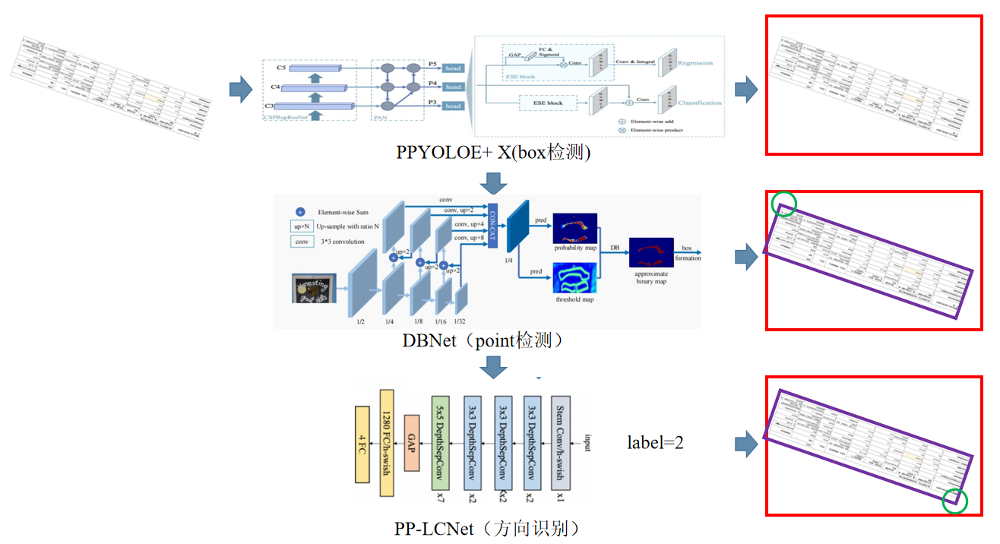
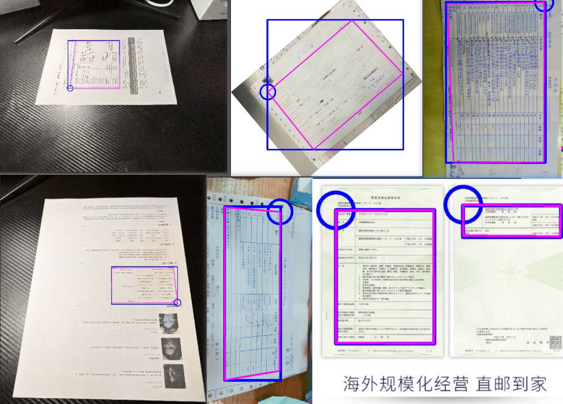

<div align="center">
  <div align="center">
    <h1><b>📊RapidTableDetection</b></h1>
  </div>
  <a href="">=3.8,<3.12-aff.svg"></a>
  <a href=""></a>
<a href="https://semver.org/"></a>
  <a href="https://github.com/psf/black"></a>
  <a href="https://github.com/RapidAI/TableStructureRec/blob/c41bbd23898cb27a957ed962b0ffee3c74dfeff1/LICENSE"></a>
</div>

### 最近更新
- **2024.10.15**
    - 完成初版代码，包含目标检测，语义分割，角点方向识别三个模块

### 简介
💡✨ 强大且高效的表格检测，支持论文、期刊、杂志、发票、收据、签到单等各种表格。

🚀 支持高精度 Paddle 版本和量化 ONNX 版本，单图 CPU 推理仅需 1.5 秒，Paddle-GPU(V100) 仅需 0.2 秒。

🛠️ 支持三个模块自由组合，独立训练调优，提供 ONNX 转换脚本和微调训练方案。

🌟 whl 包轻松集成使用，为下游 OCR、表格识别和数据采集提供强力支撑。

📚参考项目 [百度表格检测大赛第2名方案](https://aistudio.baidu.com/projectdetail/5398861?searchKeyword=%E8%A1%A8%E6%A0%BC%E6%A3%80%E6%B5%8B%E5%A4%A7%E8%B5%9B&searchTab=ALL) 的实现方案，补充大量真实场景数据再训练

👇🏻训练数据集在致谢, 作者天天上班摸鱼搞开源，希望大家点个⭐️支持一下

### 使用建议
📚 文档场景: 无透视旋转，只使用目标检测\
📷 拍照场景小角度旋转(-90~90): 默认左上角，不使用角点方向识别\
🔍 使用在线体验找到适合你场景的模型组合
### 在线体验


### 效果展示

### 安装
为简化使用，已经将最小的量化模型打包到 rapid_table_det 中，需要更高精度或gpu推理，请自行下载对应模型
🪜下载模型 [modescope模型仓](https://www.modelscope.cn/models/jockerK/TableExtractor) [release assets](https://github.com/Joker1212/RapidTableDetection/releases/tag/v0.0.0)
``` python {linenos=table}
# 建议使用清华源安装 https://pypi.tuna.tsinghua.edu.cn/simple
pip install rapid-table-det
```
### 快速使用
``` python {linenos=table}
from rapid_table_det.inference import TableDetector
table_det = TableDetector()
img_path = f"tests/test_files/chip.jpg"
result, elapse = table_det(img_path)
obj_det_elapse, edge_elapse, rotate_det_elapse = elapse
print(
    f"obj_det_elapse:{obj_det_elapse}, edge_elapse={edge_elapse}, rotate_det_elapse={rotate_det_elapse}"
)
# 输出可视化
# import os
# import cv2
# from rapid_table_det.utils import img_loader, visuallize, extract_table_img
# img = img_loader(img_path)
# file_name_with_ext = os.path.basename(img_path)
# file_name, file_ext = os.path.splitext(file_name_with_ext)
# out_dir = "rapid_table_det/outputs"
# if not os.path.exists(out_dir):
#     os.makedirs(out_dir)
# extract_img = img.copy()
# for i, res in enumerate(result):
#     box = res["box"]
#     lt, rt, rb, lb = res["lt"], res["rt"], res["rb"], res["lb"]
#     # 带识别框和左上角方向位置
#     img = visuallize(img, box, lt, rt, rb, lb)
#     # 透视变换提取表格图片
#     wrapped_img = extract_table_img(extract_img.copy(), lt, rt, rb, lb)
#     cv2.imwrite(f"{out_dir}/{file_name}-extract-{i}.jpg", wrapped_img)
# cv2.imwrite(f"{out_dir}/{file_name}-visualize.jpg", img)

```
### gpu版本使用
必须下载模型，指定模型位置！
``` python {linenos=table}
# 建议使用清华源安装 https://pypi.tuna.tsinghua.edu.cn/simple
pip install rapid-table-det-paddle (默认安装gpu版本，可以自行覆盖安装cpu版本paddlepaddle)
```
```python
from rapid_table_det_paddle.inference import TableDetector

img_path = f"tests/test_files/chip.jpg"

table_det = TableDetector(
    obj_model_path="models/obj_det_paddle",
    edge_model_path="models/edge_det_paddle",
    cls_model_path="models/cls_det_paddle",
    use_obj_det=True,
    use_edge_det=True,
    use_cls_det=True,
)
result, elapse = table_det(img_path)
obj_det_elapse, edge_elapse, rotate_det_elapse = elapse
print(
    f"obj_det_elapse:{obj_det_elapse}, edge_elapse={edge_elapse}, rotate_det_elapse={rotate_det_elapse}"
)
# 一张图片中可能有多个表格
# img = img_loader(img_path)
# file_name_with_ext = os.path.basename(img_path)
# file_name, file_ext = os.path.splitext(file_name_with_ext)
# out_dir = "rapid_table_det_paddle/outputs"
# if not os.path.exists(out_dir):
#     os.makedirs(out_dir)
# extract_img = img.copy()
# for i, res in enumerate(result):
#     box = res["box"]
#     lt, rt, rb, lb = res["lt"], res["rt"], res["rb"], res["lb"]
#     # 带识别框和左上角方向位置
#     img = visuallize(img, box, lt, rt, rb, lb)
#     # 透视变换提取表格图片
#     wrapped_img = extract_table_img(extract_img.copy(), lt, rt, rb, lb)
#     cv2.imwrite(f"{out_dir}/{file_name}-extract-{i}.jpg", wrapped_img)
# cv2.imwrite(f"{out_dir}/{file_name}-visualize.jpg", img)

```
#### 参数说明
```
table_det = TableDetector(\
# 目标检测表格模型
obj_model_path="models/obj_det_paddle(obj_det.onnx)", \ 
# 边角检测表格模型(从复杂环境得到表格多边形框)
edge_model_path="models/edge_det_paddle(edge_det.onnx)", \
# 角点方向识别
cls_model_path="models/cls_det_paddle(cls_det.onnx)", \
# 文档场景已经由版面识别模型提取可以不使用
use_obj_det=True, \
# 只有90，180，270大角度旋转且无透视时候可以不使用
use_edge_det=True, \
# 小角度(-90~90)旋转可以不使用
use_cls_det=True, \
)
```

## FAQ (Frequently Asked Questions)

1. **问：如何微调模型适应特定场景?**
    - 答：直接参考这个项目，有非常详细的可视化操作步骤,可以得到paddle的推理模型 [百度表格检测大赛](https://aistudio.baidu.com/projectdetail/5398861?searchKeyword=%E8%A1%A8%E6%A0%BC%E6%A3%80%E6%B5%8B%E5%A4%A7%E8%B5%9B&searchTab=ALL) 

2. **问：如何导出onnx**
   - 答：在本项目tools下，有onnx_transform.ipynb文件，可以照步骤执行(因为pp-yoloe导出onnx有bug一直没修，这里我自己写了一个fix_onnx脚本改动onnx模型节点来临时解决了)

3. **问：图片有扭曲可以修正吗？**
    - 答：本项目只解决旋转和透视场景的表格提取，对于扭曲的场景，需要先进行扭曲修正

### 致谢
[百度表格检测大赛第2名方案](https://aistudio.baidu.com/projectdetail/5398861?searchKeyword=%E8%A1%A8%E6%A0%BC%E6%A3%80%E6%B5%8B%E5%A4%A7%E8%B5%9B&searchTab=ALL) \
[WTW 自然场景表格数据集](https://tianchi.aliyun.com/dataset/108587) \
[FinTabNet PDF文档表格数据集](https://developer.ibm.com/exchanges/data/all/fintabnet/) \
[TableBank 表格数据集](https://doc-analysis.github.io/tablebank-page/) \
[TableGeneration 表格自动生成工具](https://github.com/WenmuZhou/TableGeneration)
### 贡献指南

欢迎提交请求。对于重大更改，请先打开issue讨论您想要改变的内容。

有其他的好建议和集成场景，作者也会积极响应支持

### 开源许可证

该项目采用[Apache 2.0](https://github.com/RapidAI/TableStructureRec/blob/c41bbd23898cb27a957ed962b0ffee3c74dfeff1/LICENSE)
开源许可证。

